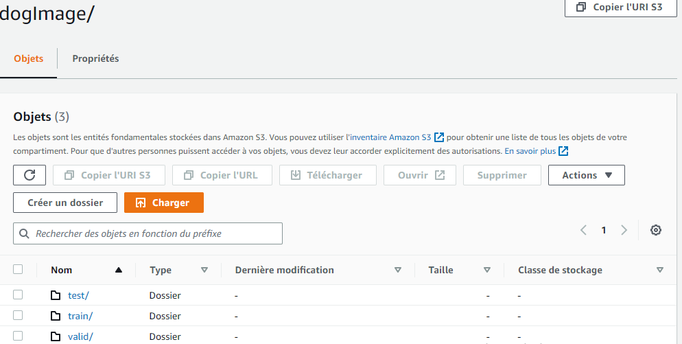

# Image Classification using AWS SageMaker

Use AWS Sagemaker to train a pretrained model that can perform image classification by using the Sagemaker profiling, debugger, hyperparameter tuning and other good ML engineering practices. This can be done on either the provided dog breed classication data set or one of your choice.

## Project Set Up and Installation
Enter AWS through the gateway in the course and open SageMaker Studio. 
Download the starter files.
Download/Make the dataset available. 
### files used
hpo.py: script is what will train the model.
train_model.py: script is what will train model with hook for debugging and profiling our training for best hyperParametrs.
train_and_deploy.ipynb : notebook will help to interface with Sagemaker and submit training jobs to it.
inference.py : script used for deploying the model, perform some preprocessing (transformations) , serialization- deserialization and predictions/inferences

## Dataset
The provided dataset is the dogbreed classification dataset which can be found in the classroom.
The project is designed to be dataset independent so if there is a dataset that is more interesting or relevant to your work, you are welcome to use it to complete the project.

### Access
Upload the data to an S3 bucket through the AWS Gateway so that SageMaker has access to the data. 

## Hyperparameter Tuning
What kind of model did you choose for this experiment and why? Give an overview of the types of parameters and their ranges used for the hyperparameter search
i use resnet50 with two layer linear nn fully connected. i choose resnet50 model because it's between of the top models classification for image multiclass, resNet50 is 50 layers deep and is trained on a million images of 1000 categories from the ImageNet database.
for optimizer i used Adam from torch.optim
hyperparameter_ranges = {
    "lr": ContinuousParameter(0.001, 0.1),
    "batch-size": CategoricalParameter([32, 64,128]),
    "epochs":IntegerParameter(2,8)
}

Remember that your README should:
- Include a screenshot of completed training jobs
- Logs metrics during the training process
- Tune at least two hyperparameters
- Retrieve the best best hyperparameters from all your training jobs

## Debugging and Profiling
for performed model debugging and profiling in Sagemaker, i added hook to record and keep track of the Loss criterion metrics of the process in training and validation/testing phases.

### Results
with debugging we can check how well our model training is happening. and show us results(parameters+ metrics) of training .

best HyperParamerts used for our model training

## Model Deployment
Model was deployed to a "ml.m5.large" instance type and "inference.py" script is used to setup and deploy our model endpoint.
For testing purposes ,two test images are [Pekingese_07585.jpg,Affenpinscher_00001.jpg]stored in current folder.
we are reading those test images and try to send those images as input and invoke our deployed endpoin.
The inference is performed using the Predictor Object.

